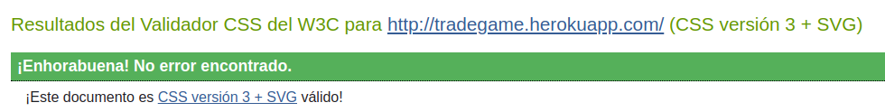
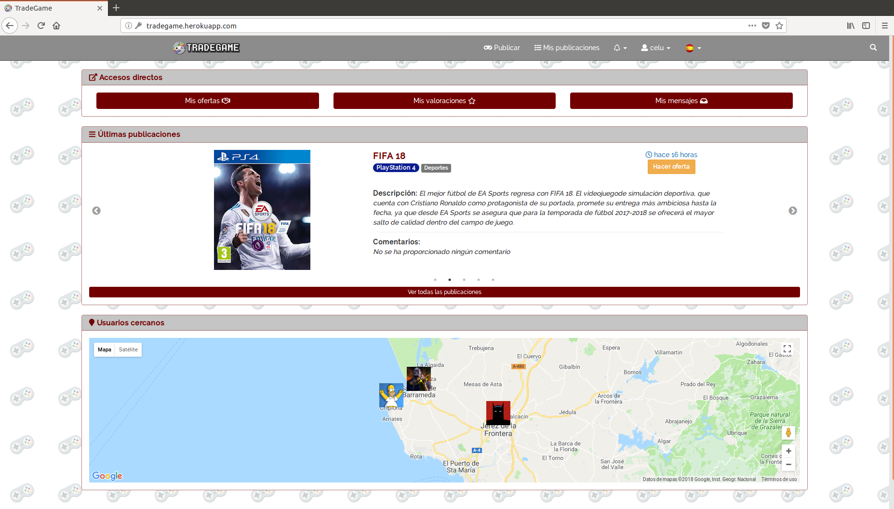
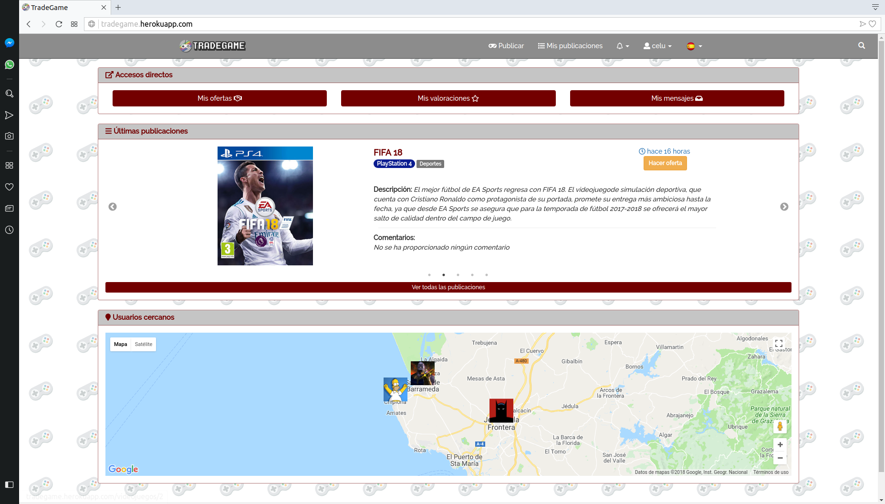
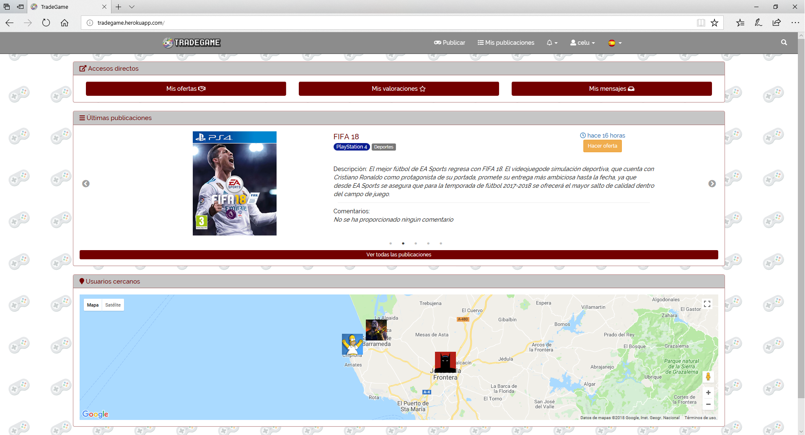

# Anexos

### (R60) Validación de HTML y CSS, nivel de accesibilidad AA y prueba del seis
***
### Validación de HTML y CSS

***HTML***

[Enlace a la validación HTML](https://validator.w3.org/nu/?doc=http%3A%2F%2Ftradegame.herokuapp.com%2F)

***CSS***

[Enlace a la validación CSS](https://jigsaw.w3.org/css-validator/validator?uri=http%3A%2F%2Ftradegame.herokuapp.com%2F&profile=css3svg&usermedium=all&warning=1&vextwarning=&lang=es)

***

### Prueba del seis

 1. ¿Qué sitio es éste?

  * En la barra de navegación superior del sitio web, podemos ver el logotipo con el nombre de la aplicación, que permanecerá en todas las páginas.  
 2. ¿En qué página estoy?

  * Durante todo el recorrido del sitio web, tendremos en la parte superior de cada página un bloque con las migas de pan que nos indican en qué parte de la aplicación nos encontramos.  

 3. ¿Qué sitio es éste?

  * Las principales secciones del sitio son *Publicar*, *Mis publicaciones*, *Notificaciones* y *Mi Perfil* (algunas secciones serán visibles si estamos logueados en la aplicación).  

 4. ¿Qué opciones tengo en este nivel?

  * En la barra de navegación, algunas secciones como la de *Notificaciones* tiene submenú que nos ofrece distintas opciones como la de acceder a *Ofertas*, *Valoraciones* o *Mensajes*.  

 5. ¿Dónde estoy en el esquema de las cosas?

  * En todas las páginas tenemos disponible un bloque con las migas de pan en la zona superior.

 6. ¿Cómo busco algo?

  * En la barra de navegación, tenemos un icono de una lupa en la zona derecha que si lo pulsamos nos aparecerá un campo de texto que ocupará toda la barra para poder buscar por el título del videojuego.

***

### (R62) Comprobación en varios navegadores

 *** Google Chrome ***

 *** Mozilla Firefox ***

 *** Opera ***

 *** Microsoft Edge ***

