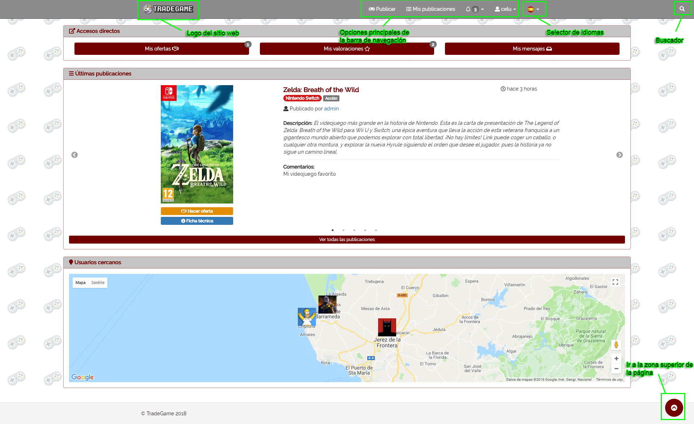
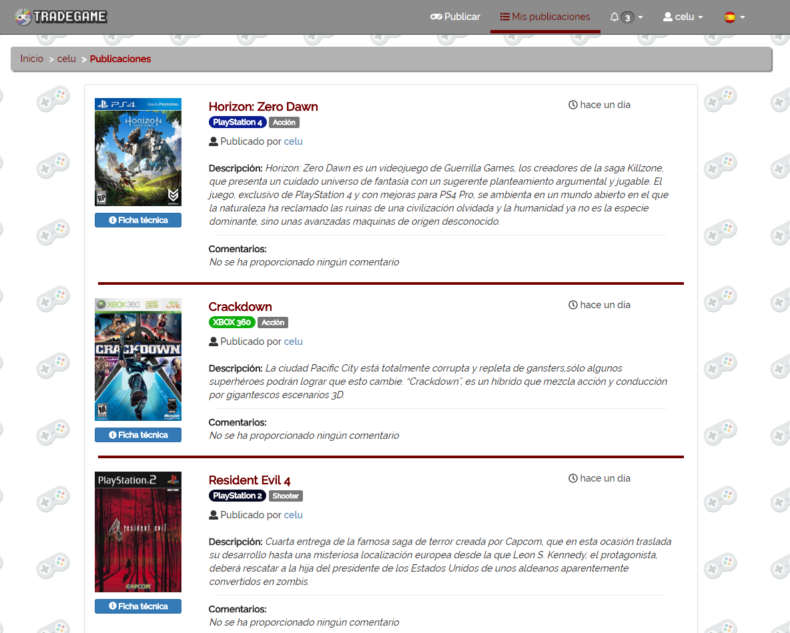
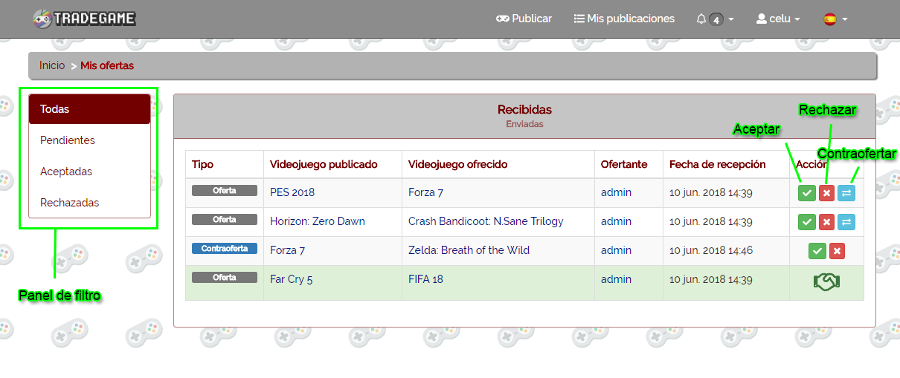
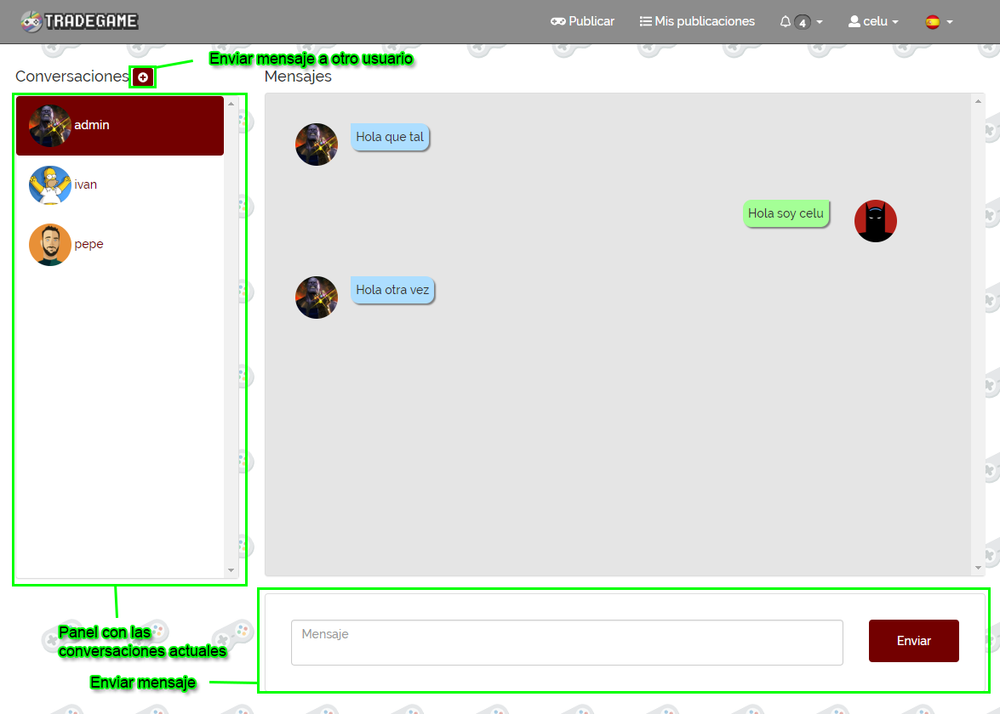
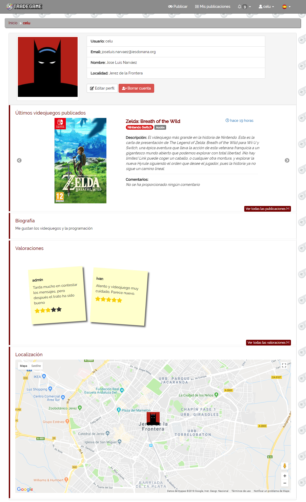
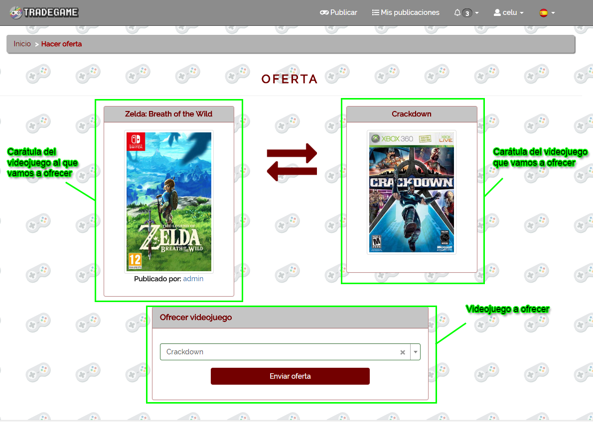

# Manual de usuario
---

### Página de inicio

En la página de inicio podremos ver en la parte superior la barra de navegación (que será permanente en todas las páginas de la aplicación), en la cuál tenemos el logotipo del sitio en la zona izquierda, y además tenemos distintas opciones en la zona derecha de la barra de navegación.

Desde ***Publicar*** podremos publicar un nuevo videojuego para poder intercambiarlo.

En ***Mis publicaciones*** podemos ver todas las publicaciones que hemos realizado, y tenemos pendientes de intercambiar.

Desde ***Notificaciones*** (*icono de la campana*) tenemos un desplegable desde el cuál podemos acceder a ***Ofertas*** (para ver las ofertas recibidas y enviadas), ***Valoraciones*** (para ver las valoraciones que hemos enviado a los demás usuarios) y ***Mensajes*** (para ver las conversaciones que tenemos con los demás usuarios).

Justo al lado de estas opciones principales, tenemos el selector de idiomas, en el que podremos elegir entre *Español* e *Inglés*.

En la zona más a la derecha de la barra de navegación tenemos el buscador, en el cuál si hacemos click, nos aparecerá un campo que sustituirá la barra de navegación por un campo de texto para poder buscar por un videojuego.

En el cuerpo de la página de inicio podremos ver tres bloques:

* __Accesos directos__: Botones para acceder más rápidamente a los apartados que aparecen en *Notificaciones*.
* __Últimas publicaciones__: Aparecerá los últimos 5 videojuegos publicados por los usuarios en forma de slider. Además tendremos debajo un botón para poder ver todas las publicaciones que se han hecho en el sitio wbe.
* __Usuarios cercanos__: Podremos ver nuestro avatar "botando" en el mapa, y los avatares del resto de usuarios que estén dentro de un radio de 100km a partir de nuestra ubicación.

---

### Página de publicar

Desde está página podremos publicar un videojuego para poder intercambiarlo.

En el formulario de publicación podremos escribir el videojuego que queremos publicar, y nos saldrá un desplegable con los videojuegos sugeridos a partir del texto que llevemos escrito.
Una vez seleccionemos uno, se nos cargarán los datos del videdojuego que hemos seleccionado en una ficha en la zona derecha de la página.

A parte de esto, desde el campo *Comentarios* podremos añadir un texto que acompañe a la publicación para dar más datos del videojuego (como puede ser el estado físico actual del videojuego).

Al final del formulario tenemos la opción también de poder añadir fotos del videojuego.

---

### Página de mis publicaciones

En esta pantalla podremos ver un listado con las publicaciones de videojuegos que hemos realizado y se encuentran aún pendientes de ser intercambiados.

---

### Página de ofertas

En esta página podremos ver las ofertas Recibidas y Enviadas por los usuarios.

Nos aparecerá un listado con las ofertas *recibidas*, que también podremos cambiar a ofertas *enviadas* desde la cabecera del panel donde se encuentra el listado de ofertas.

En la zona izquierda de la página tendremos un panel con el cuál podremos filtrar por el estado de la oferta.

En la última columna de la tabla en la que se encuentran las ofertas, tendremos unos botones para realizar acciones (a no ser que ya se hayan aceptado o rechazado):

 * __Aceptar__: Aceptar el intercabmio.
 * __Rechazar__: Rechazar el intercambio.
 * __Contraoferta__: Realizar una nueva propuesta de intercambio al usuario que te la ha envíado.

 ---

### Página de valoraciones

En esta página podremos ver las valoraciones que hemos enviado a otros usuarios al hacer intercambios con ellos.

En la tabla nos aparecerán los datos de la valoración. Si no lo hemos valorado aún nos aparecerá como *Comentario* el texto `Pendiente de valorar`, y además nos aparecerá un botón en la columna *Valoración*, para poder ir a valorarlo.

 ---

### Página de mensajes

Desde esta pantalla podremos mantener conversaciones a tiempo real con otros usuarios.

Podremos iniciar una nueva conversación desde el botón que aparece a la derecha del título *Conversaciones*.

En el panel de las conversaciones, podremos ver los usuarios con los que actualmente estamos chateando.

Si hacemos click sobre uno de los usuarios, podremos ver en la zona derecha los mensajes que hemos intercambiado con ese usuario.

Finalmente, en la zona inferior tendremos un campo de texto para poder enviar un mensaje rápidamente a la conversación que estamos viendo actualmente.

---

### Página de modificación de datos

Desde esta página podemos visualizar y modificar los distintos datos de nuestro perfil.

En el panel de la izquierda podremos *"filtrar"* para que nos muestre los datos que nos interesa cambiar, y así hacerlo más rápidamente.

---

### Página de perfil de usuario

En la página del perfil de un usuario podremos encontrar distintos bloques.

En el bloque superior podremos ver la foto del usuario del perfil, con sus respectivos datos, y dos botones para `Editar perfil` y `Borrar cuenta`. Si el perfil que estamos visitando no es nuestro perfil, nos aparecerán los botones `Enviar mensaje` y `Reportar`.

El bloque de debajo de los datos del usuario, se encarga de mostrar en un slider, los 3 últimos videojuegos publicados por el usuario.

El siguiente bloque consta de la ***Biografía*** facilitada por el usuario.

Más debajo podremos ver las valoraciones que ha recibido el usuario, a través de bloques que imitan unas *Sticky Notes*. Estos bloques tendrán como información, el usuario que ha valorado al usuario, el texto que acompaña a la valoración (que es opcional), y el número de estrellas que se le ha dado en la valoración.

Por último tendremos un bloque en el que podremos ver un mapa con nuestra localización (si tenemos configurada nuestra dirección en la pantalla de *modificar datos*). En este último bloque, si visitamos un perfil distinto al nuestro, nos aparecerá nuestra localización y la del usuario que visitamos, para poder ver a qué distancia estamos del usuario.

---

### Página de ofertar

En esta página veremos en el recuadro de la izquierda, el videojuego por el cuál vamos a hacer una oferta, y el recuadro de la derecha se cargará en base al videojuego que vayamos a ofrecer en el formulario de debajo.

---

### Página de publicación

En esta página podemos ver con más detalle una publicación en concreto.

En la zona superior, tenemos tanto el usuario que ha publicado el videojuego, como el tiempo que hace que se publicó el videojuego.

Tras esto tenemos la distinta información sobre el videojuego en concreto.

En la zona inferior podremos ver los comentarios que ha proporcionado el usuario al publicar el videojuego, y también las fotos que ha subido.

Después de todo esto, tenemos la posibilidad de enviar una oferta por el videojuego desde el botón `Hacer oferta`.

---

### Página de búsqueda

Esta pantalla muestra un listado de videojuegos en base a la búsqueda que se haya realizado desde la barra de navegación.
